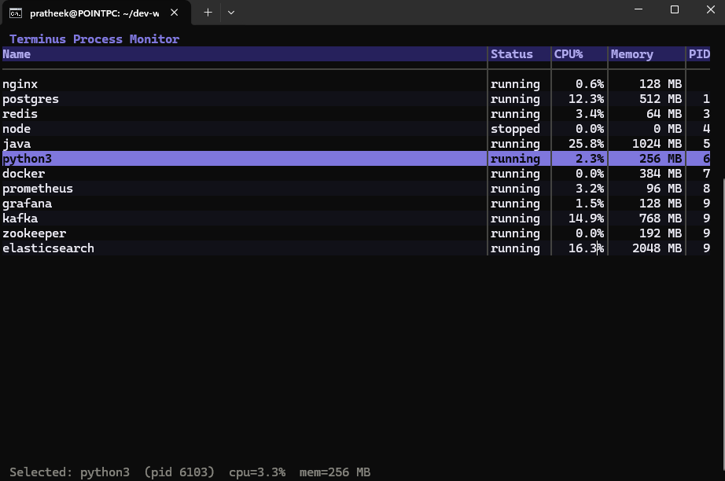
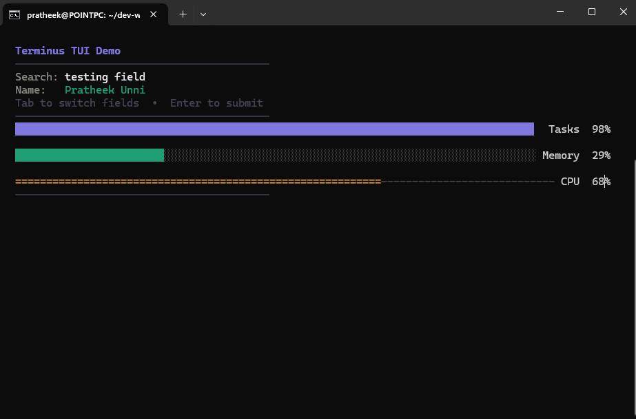

<div align="center">

```
████████╗███████╗██████╗ ███╗   ███╗██╗███╗   ██╗██╗   ██╗███████╗
╚══██╔══╝██╔════╝██╔══██╗████╗ ████║██║████╗  ██║██║   ██║██╔════╝
   ██║   █████╗  ██████╔╝██╔████╔██║██║██╔██╗ ██║██║   ██║███████╗
   ██║   ██╔══╝  ██╔══██╗██║╚██╔╝██║██║██║╚██╗██║██║   ██║╚════██║
   ██║   ███████╗██║  ██║██║ ╚═╝ ██║██║██║ ╚████║╚██████╔╝███████║
   ╚═╝   ╚══════╝╚═╝  ╚═╝╚═╝     ╚═╝╚═╝╚═╝  ╚═══╝ ╚═════╝ ╚══════╝
```

**A React-inspired TUI framework for Java 21**

[](https://github.com/P0intMaN/terminus/actions/workflows/ci.yaml)
[](https://openjdk.org/projects/jdk/21/)
[](LICENSE)
[](https://central.sonatype.com/artifact/io.terminus/terminus-core)

*Build rich terminal UIs in Java with components, declarative layout, and 60fps rendering.*

</div>

---

## What is Terminus?

Terminus is a **zero-dependency TUI framework** for Java 21 that brings the component model from React and Flutter to the terminal.

You compose components. Terminus handles the rest — raw mode, ANSI escape sequences, double-buffered rendering, keyboard input parsing, and the 60fps event loop.

```java
// A complete TUI app in ~10 lines
public static void main(String[] args) {
    Layout root = Layout.column().padding(1).build();
    root.add(Text.bold("My App", 0x7F77DD));
    root.addFlex(Table.builder(model, columns).build());
    root.add(statusBar);
    TerminusApp.run(root);
}
```

---

## Quick demo






---

## Features

| Feature | Description |
|---|---|
| **Component model** | Composite pattern — everything is a `Component` |
| **Declarative layout** | Flex row/column with gap, padding, alignment |
| **Virtual scrolling** | Tables with 100k+ rows render in O(visible rows) |
| **60fps rendering** | Double-buffered, diff-based ANSI output — zero flicker |
| **Rich components** | `Table`, `TextInput`, `ProgressBar`, `Text`, `Layout` |
| **Keyboard + mouse** | Full ANSI escape sequence parser, SGR mouse support |
| **Zero runtime deps** | Only JNA for raw terminal mode |
| **Java 21** | Records, sealed classes, virtual threads |

---

## Installation

### Gradle

```groovy
dependencies {
    implementation 'io.terminus:terminus-core:1.0.0'
}
```

### Maven

```xml
<dependency>
    <groupId>io.terminus</groupId>
    <artifactId>terminus-core</artifactId>
    <version>1.0.0</version>
</dependency>
```

---

## Examples

### 1. Hello World

The simplest possible Terminus app:

```java
import io.terminus.core.*;
import io.terminus.core.components.Text;

public class HelloWorld {
    public static void main(String[] args) {
        TerminusApp.run(Text.bold("Hello, Terminus!", 0x7F77DD));
    }
}
```

---

### 2. ProgressBar — four styles

```java
import io.terminus.core.*;
import io.terminus.core.components.*;
import io.terminus.core.components.Layout;

public class ProgressBarExample {

    static class Demo extends Leaf {
        private double value = 0.0;

        // All four styles, built once
        private final ProgressBar eighths = ProgressBar.builder()
            .style(ProgressBar.Style.EIGHTHS)
            .fg(0x7F77DD).label("Downloading").build();

        private final ProgressBar block = ProgressBar.builder()
            .style(ProgressBar.Style.BLOCK)
            .fg(0x1D9E75).label("Extracting").build();

        private final ProgressBar ascii = ProgressBar.builder()
            .style(ProgressBar.Style.ASCII)
            .fg(0xEF9F27).label("Installing").build();

        private final ProgressBar braille = ProgressBar.builder()
            .style(ProgressBar.Style.BRAILLE)
            .fg(0xD4537E).label("Verifying").build();

        @Override
        public boolean onEvent(io.terminus.core.event.Event e) {
            if (e instanceof io.terminus.core.event.StateChangeEvent s
                    && "tick".equals(s.key())) {
                value = (value + 0.005) % 1.01;
                eighths.setValue(value);
                block.setValue(Math.min(1.0, value * 1.2));
                ascii.setValue(Math.min(1.0, value * 0.8));
                braille.setValue(Math.min(1.0, value * 1.5));
                markDirty();
            }
            return false;
        }

        // ... render() composites the four bars into the grid
    }
}
```

**What you see:**

```
████████████▌·············  Downloading  62%
████████████████░░░░░░░░░░  Extracting   64%
=============--------------  Installing  50%
⣿⣿⣿⣿⣿⣿⣿⣿⡇⠀⠀⠀⠀⠀⠀⠀⠀⠀⠀  Verifying    45%
```

---

### 3. TextInput — search field with history

```java
TextInput searchInput = TextInput.builder()
    .placeholder("Search processes... (↑↓ for history)")
    .fg(0xF0EFF8)
    .maxLength(100)
    .onSubmit(query -> {
        // Called when user presses Enter
        results.add(search(query));
        markDirty();
    })
    .onChange(query -> {
        // Called on every keystroke — for live search
        liveFilter(query);
        markDirty();
    })
    .build();

searchInput.setFocused(true);
```

**Supported key bindings out of the box:**

| Key | Action |
|---|---|
| `←` `→` | Move cursor |
| `Ctrl+←` `Ctrl+→` | Jump word |
| `Home` `End` | Start / end of line |
| `Shift+←` `Shift+→` | Extend selection |
| `Ctrl+A` | Select all |
| `Ctrl+X` / `Ctrl+C` / `Ctrl+V` | Cut / copy / paste |
| `Ctrl+K` | Delete to end of line |
| `Ctrl+U` | Delete to start of line |
| `↑` `↓` | Navigate history |
| `Enter` | Submit |

---

### 4. Table — virtual scrolling with sort

```java
// Define your row type
record Process(String name, String status, double cpu, long memMb, int pid) {}

// Build a typed model — one column extractor per column
ListTableModel<Process> model = ListTableModel.<Process>builder()
    .column(p -> p.name())
    .column(p -> p.status())
    .column(p -> String.format("%.1f%%", p.cpu()),
            p -> p.cpu())                         // numeric sort
    .column(p -> p.memMb() + " MB",
            p -> p.memMb())                        // numeric sort
    .column(p -> String.valueOf(p.pid()),
            p -> (long) p.pid())
    .build();

model.setRows(myProcessList);  // List<Process> — any size

// Define column appearance separately from data
ColumnDef[] columns = {
    ColumnDef.flex("Name",    14),                         // grows to fill
    ColumnDef.fixed("Status",  8),                         // fixed 8 chars
    ColumnDef.fixed("CPU%",    7, ColumnDef.Alignment.RIGHT),
    ColumnDef.fixed("Memory", 10, ColumnDef.Alignment.RIGHT),
    ColumnDef.fixed("PID",     6, ColumnDef.Alignment.RIGHT)
};

// Build the table
Table table = Table.builder(model, columns)
    .selectedColors(0x0a0a0f, 0x7F77DD)   // dark text on purple bg
    .onSelect(dataRow -> {
        Process p = myProcessList.get(dataRow);
        System.out.println("Selected: " + p.name());
    })
    .build();

table.setFocused(true);
```

**Table keyboard navigation:**

| Key | Action |
|---|---|
| `↑` `↓` | Move selection |
| `Home` `End` | First / last row |
| `Page Up` `Page Down` | Scroll by page |
| `s` | Sort next column (cycles) |
| `S` | Reverse sort direction |
| `r` | Reset to original order |
| `Enter` | Fire `onSelect` callback |

---

### 5. Layout — composing a real UI

```java
// Build a full UI with declarative layout:
//
//  ┌────────────────────────────────────────┐
//  │  My Dashboard                          │
//  ├──────────────────────────────────────  │
//  │  [Search: ____________________________]│
//  ├──────────────────────────────────────  │
//  │  ┌─────────────┐  ┌──────────────────┐│
//  │  │ Stats panel │  │  Main table      ││
//  │  │             │  │  (flex — fills)  ││
//  │  └─────────────┘  └──────────────────┘│
//  ├──────────────────────────────────────  │
//  │  Status bar                            │
//  └────────────────────────────────────────┘

// Search row: label + input (input takes remaining width)
Layout searchRow = Layout.row().gap(1).build();
searchRow.add(Text.plain("Search:"));
searchRow.addFlex(searchInput);

// Content row: sidebar (fixed) + table (flex)
Layout contentRow = Layout.row().gap(2).build();
contentRow.add(sidebarPanel);           // fixed width from measure()
contentRow.addFlex(mainTable);          // takes all remaining width

// Root: everything stacked vertically
Layout root = Layout.column().padding(1, 2).build();
root.add(Text.bold("My Dashboard", 0x7F77DD));
root.add(Text.muted("─".repeat(60)));
root.add(searchRow);
root.add(Text.muted("─".repeat(60)));
root.addFlex(contentRow);               // content takes all remaining height
root.add(statusBar);

// Run it
TerminusApp.run(root);
```

---

### 6. Text — word wrap and alignment

```java
// Word wrapping (default)
Text description = Text.of(
    "Terminus is a zero-dependency TUI framework for Java 21. " +
    "It brings the component model from React and Flutter to the terminal, " +
    "with declarative layout, virtual scrolling, and 60fps rendering."
).fg(0xF0EFF8)
 .align(Text.Alignment.LEFT)
 .build();

// Centered heading
Text heading = Text.of("System Status")
    .fg(0x7F77DD)
    .bold()
    .align(Text.Alignment.CENTER)
    .build();

// Right-aligned, single line with truncation
Text value = Text.of(someVeryLongString)
    .fg(0x1D9E75)
    .overflow(Text.Overflow.TRUNCATE)
    .align(Text.Alignment.RIGHT)
    .build();

// Max 3 lines — truncates with ellipsis
Text preview = Text.of(longContent)
    .maxLines(3)
    .fg(0x888780)
    .build();
```

---

### 7. Custom component — building your own

Extending `Leaf` is all you need for a custom component:

```java
/**
 * A simple CPU meter that shows a colored bar + percentage.
 * Demonstrates: state management, color logic, markDirty().
 */
public class CpuMeter extends Leaf {

    private double usage = 0.0; // 0.0 to 1.0

    public void setUsage(double usage) {
        double clamped = Math.max(0, Math.min(1, usage));
        if (Double.compare(this.usage, clamped) != 0) {
            this.usage = clamped;
            markDirty();       // triggers re-render on next frame
        }
    }

    @Override
    public Bounds measure(Constraint c) {
        // Always 1 row tall, takes available width
        return Bounds.of(c.isWidthUnbounded() ? 20 : c.maxWidth(), 1);
    }

    @Override
    public Cell[][] render() {
        Cell[][] grid = blankGrid();
        int w = getWidth();
        if (w < 4) return grid;

        // Color: green < 50%, amber 50-80%, red > 80%
        int color = usage < 0.5 ? 0x1D9E75
                  : usage < 0.8 ? 0xEF9F27
                  :               0xE24B4A;

        // Fill bar
        int filled = (int)(usage * (w - 6));
        for (int i = 0; i < w - 6; i++) {
            char ch = i < filled ? '█' : '░';
            int  fg = i < filled ? color : 0x333344;
            grid[0][i] = new Cell(ch, fg, Cell.DEFAULT_COLOR,
                Cell.ATTR_NONE, (byte) 1);
        }

        // Percentage label (right-aligned in last 5 chars)
        String pct = String.format("%4.0f%%", usage * 100);
        writeString(grid, 0, w - 5, pct, color,
            Cell.DEFAULT_COLOR, Cell.ATTR_BOLD);

        return grid;
    }
}
```

---

### 8. Animation — driving state from a timer

The correct pattern for animation in Terminus:

```java
// In your app's main():
EventLoop loop = new EventLoop(pipeline, dispatcher);

// Background timer posts events — never touches components directly
Thread timer = Thread.ofVirtual().name("timer").start(() -> {
    long lastBlink = System.currentTimeMillis();
    while (!Thread.currentThread().isInterrupted()) {
        try {
            Thread.sleep(16); // ~60fps
            long now = System.currentTimeMillis();

            // Animation tick
            loop.post(new StateChangeEvent(now, "tick", null));

            // Cursor blink at 530ms intervals
            if (now - lastBlink >= 530) {
                loop.post(new StateChangeEvent(now, "blink", null));
                lastBlink = now;
            }
        } catch (InterruptedException e) {
            Thread.currentThread().interrupt();
        }
    }
});

// In your component's onEvent():
@Override
public boolean onEvent(Event event) {
    if (event instanceof StateChangeEvent s && "tick".equals(s.key())) {
        // Mutate state here — on the UI thread
        progress += 0.005;
        markDirty();         // queue a re-render
        return false;        // don't consume — other components may need it
    }
    return false;
}
```

**The golden rule:** `render()` is **pure** — it only reads state, never mutates it.
State mutations live in `onEvent()`. This is unidirectional data flow.

---

### 9. Background data loading

```java
// Safe pattern: load data on a virtual thread, post result to UI thread
public void loadData(EventLoop loop) {
    Thread.ofVirtual().name("data-loader").start(() -> {
        // This runs on a background virtual thread — safe for blocking I/O
        List<Process> data = fetchFromDatabase();  // blocking call — fine here

        // Post result back to UI thread via the event queue
        loop.post(new StateChangeEvent(
            System.nanoTime(),
            "data.loaded",
            data           // the payload
        ));
    });
}

// In your component:
@Override
public boolean onEvent(Event event) {
    if (event instanceof StateChangeEvent s
            && "data.loaded".equals(s.key())) {
        @SuppressWarnings("unchecked")
        List<Process> data = (List<Process>) s.payload();
        model.setRows(data);
        table.refresh();
        markDirty();
        return true;
    }
    return false;
}
```

---

## Architecture

```
┌─────────────────────────────────────────────────────────────────────┐
│                         Your Application                            │
│   TerminusApp.run(rootComponent)                                    │
└──────────────────────────────┬──────────────────────────────────────┘
                               │
┌──────────────────────────────▼──────────────────────────────────────┐
│                           EventLoop                                 │
│  stdin reader (virtual thread) ──► BlockingQueue<Event>             │
│  UI thread: drain queue ──► dispatch ──► render if dirty            │
└───────────┬────────────────────────────────────────┬────────────────┘
            │ dispatch                               │ render
┌───────────▼────────────┐              ┌────────────▼────────────────┐
│    EventDispatcher     │              │       RenderPipeline        │
│  Chain of Responsibility│              │  LayoutEngine               │
│  focused → parent → root│             │  Renderer (tree walk)        │
└────────────────────────┘              │  ScreenDiffer (delta only)  │
                                        │  AnsiWriter (atomic flush)   │
┌──────────────────────────────────────┐│  ScreenBuffer (double buffer)│
│         Component Tree               │└─────────────────────────────┘
│                                      │
│  Component (abstract)                │  Cell (record)
│  ├── Leaf                            │  ├── glyph: int (Unicode)
│  │   ├── Text                        │  ├── fg: int (0xRRGGBB)
│  │   ├── ProgressBar                 │  ├── bg: int (0xRRGGBB)
│  │   ├── TextInput                   │  ├── attrs: byte (bold|italic|...)
│  │   ├── Table                       │  └── width: byte (1 or 2)
│  │   └── [your component]            │
│  └── Container                       │  Bounds (record)
│      └── Layout (row|column)         │  ├── x, y: int
│          ├── gap, padding            │  ├── width, height: int
│          └── flex sizing             │  └── spatial operations
└──────────────────────────────────────┘
```

---

## Design patterns used

| Pattern | Where | Why |
|---|---|---|
| **Composite** | `Component / Container / Leaf` | Uniform tree traversal |
| **Visitor** | `Renderer` walking the tree | Decouples rendering from components |
| **Chain of Responsibility** | `EventDispatcher` | Event bubbling up the focus path |
| **Observer** | `markDirty()` bubbling | Components notify ancestors without coupling |
| **Builder** | Every component | Readable multi-option construction |
| **Template Method** | `LayoutEngine` | Fixed algorithm, swappable steps |
| **Strategy** | `FlexConfig`, `TableModel` | Swappable algorithms and data sources |
| **Command** | `Event` sealed hierarchy | Events as first-class objects |
| **Double Buffer** | `ScreenBuffer` | Tear-free rendering |
| **Repository** | `TableModel` | Data access behind an interface |
| **Facade** | `TerminusApp`, `RenderPipeline` | Simple entry points over complex subsystems |
| **State Machine** | `KeyParser` | Escape sequence parsing |
| **Value Object** | `Cell`, `Bounds`, `Constraint` | Immutable records throughout |

---

## Project structure

```
terminus/
├── terminus-core/          # The framework — import this
│   └── src/main/java/io/terminus/core/
│       ├── Cell.java               # Atomic unit of rendering
│       ├── Bounds.java             # Immutable position + size
│       ├── Constraint.java         # Layout measurement contract
│       ├── Component.java          # Composite pattern root
│       ├── Leaf.java               # Terminal node (renders directly)
│       ├── Container.java          # Internal node (has children)
│       ├── LayoutAccess.java       # Package-private bridge
│       ├── TerminusApp.java        # One-line entry point
│       ├── event/                  # Sealed event hierarchy
│       │   ├── Event.java
│       │   ├── KeyEvent.java
│       │   ├── MouseEvent.java
│       │   ├── ResizeEvent.java
│       │   └── StateChangeEvent.java
│       ├── render/                 # Rendering pipeline
│       │   ├── Ansi.java           # ANSI escape sequence builders
│       │   ├── AnsiWriter.java     # Atomic stdout flush
│       │   ├── ScreenBuffer.java   # Double buffer
│       │   ├── ScreenDiffer.java   # Delta computation
│       │   ├── Renderer.java       # Tree walk → Cell[][]
│       │   └── RenderPipeline.java # Facade over render subsystem
│       ├── layout/                 # Layout engine
│       │   ├── LayoutEngine.java
│       │   └── FlexConfig.java
│       └── components/             # Built-in components
│           ├── Text.java
│           ├── ProgressBar.java
│           ├── TextInput.java
│           ├── Layout.java
│           ├── Table.java
│           ├── TableModel.java
│           ├── ListTableModel.java
│           └── ColumnDef.java
│
└── terminus-demo/          # Example applications
    └── src/main/java/io/terminus/demo/
        └── DemoApp.java    # Live process monitor
```

---

## Running the demo

```bash
# Build
./gradlew :terminus-demo:shadowJar

# Run (must be a real terminal — not via Gradle)
java --enable-preview -jar terminus-demo/build/libs/terminus-demo.jar

# Or use the helper script
./run-demo.sh
```

---

## Building from source

Requirements: **Java 21**, **Gradle 8.1+**

```bash
git clone https://github.com/P0intMaN/terminus.git
cd terminus

# Build and test
./gradlew build

# Run tests with output
./gradlew test --info

# Build the fat JAR
./gradlew :terminus-demo:shadowJar
```

---

## Roadmap

- [ ] `ScrollView` — scrollable content pane
- [ ] `Tree` — expandable tree view component
- [ ] `Modal` — overlay with focus trap
- [ ] `Sparkline` — inline time-series mini-chart
- [ ] Mouse click routing to components
- [ ] Terminal resize live reflow
- [ ] macOS support (different `termios` struct layout)
- [ ] GraalVM `native-image` configuration for zero-startup binaries
- [ ] Maven Central publication

---

## Contributing

Contributions welcome. Please:
1. Open an issue before a large PR
2. Add tests for new components (see `ProgressBarTest` as a template)
3. Keep zero runtime dependencies in `terminus-core`
4. Follow the existing naming conventions

---

## License

MIT — see [LICENSE](LICENSE).

---

<div align="center">

Built with Java 21 · Inspired by [Bubble Tea](https://github.com/charmbracelet/bubbletea) · No runtime dependencies

</div>
